# 📄 Planeación del Sistema en Jira

## Desglose de trabajo: Épicas, Historias de Usuario y Tareas

La implementación de los requerimientos identificados de Bankify se desglosa de la siguiente manera:

### 1. Épica:

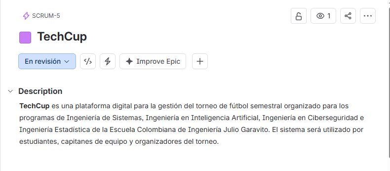

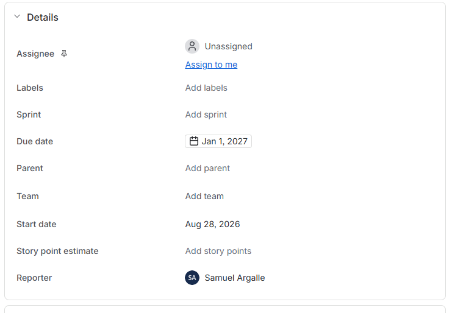

### 2. Historias de usuario:

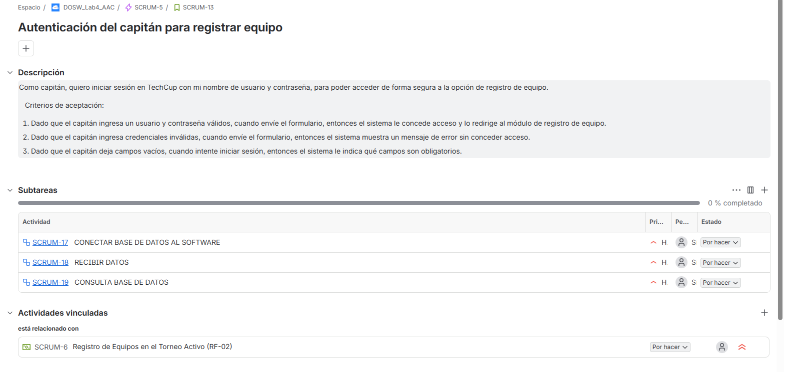
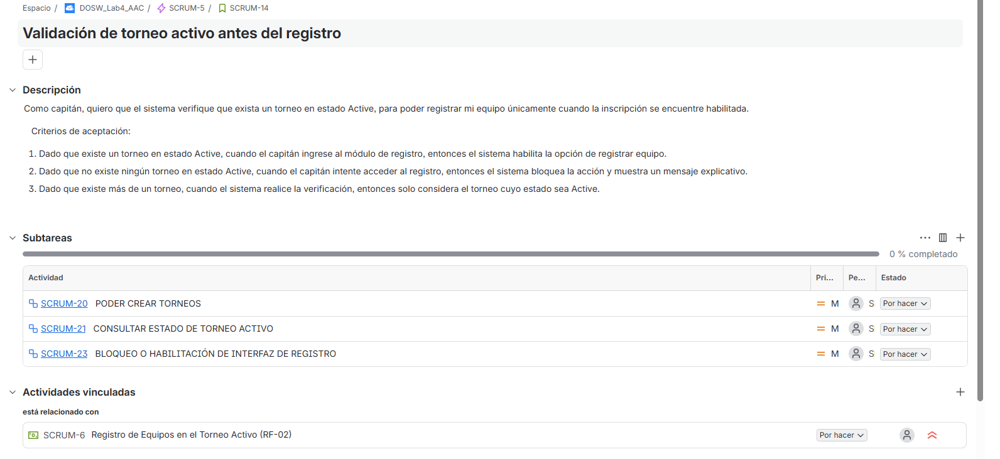
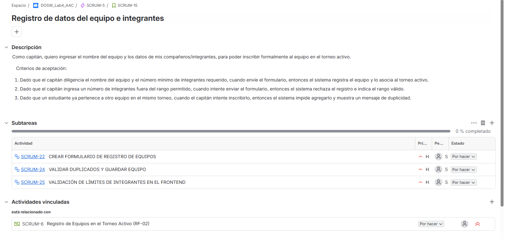
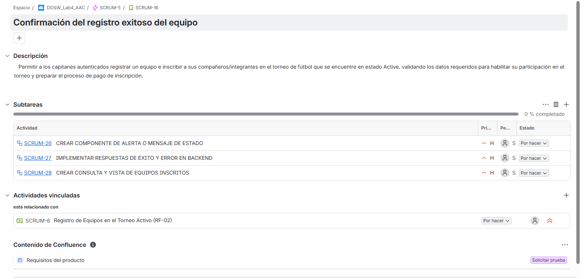

### 3. Tareas:

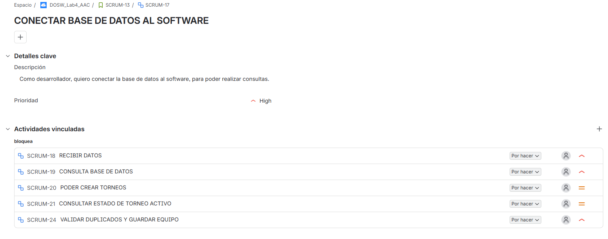
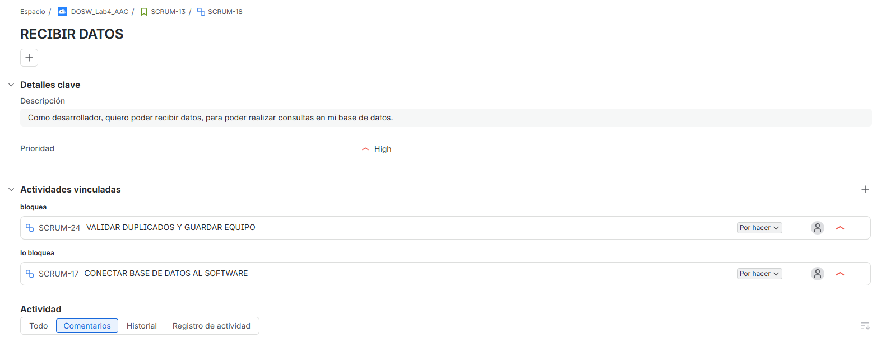
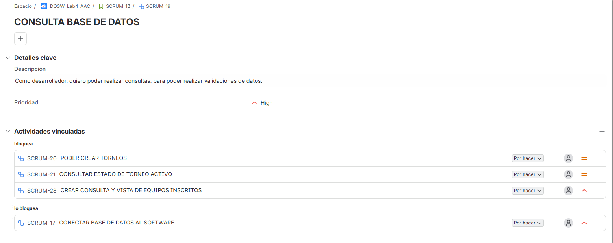
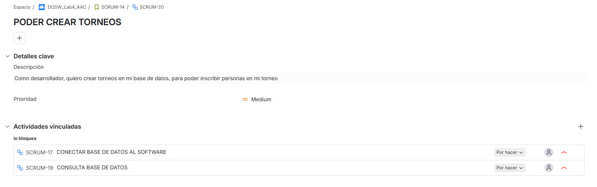
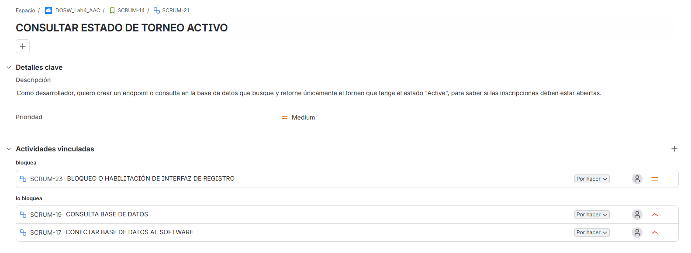
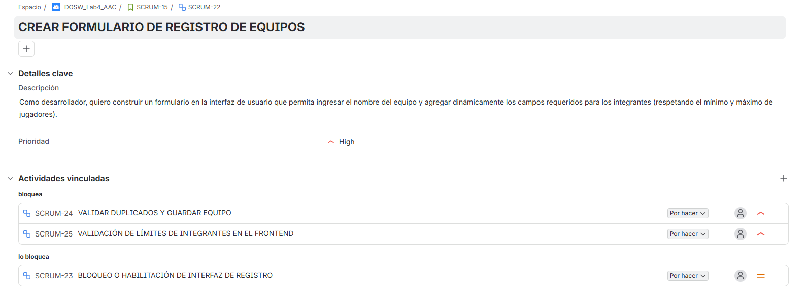
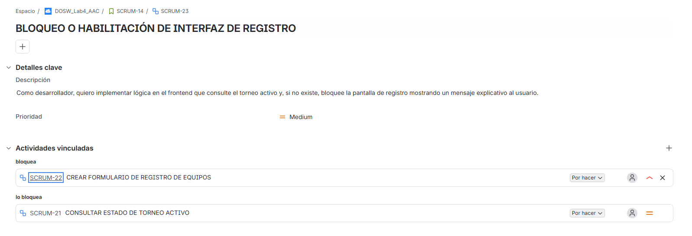
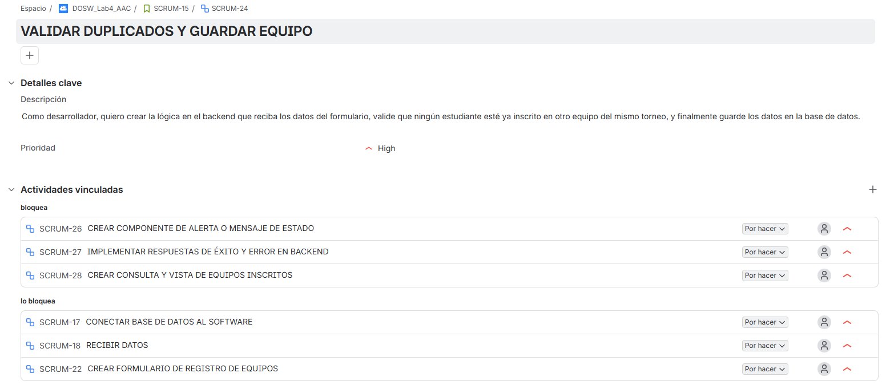
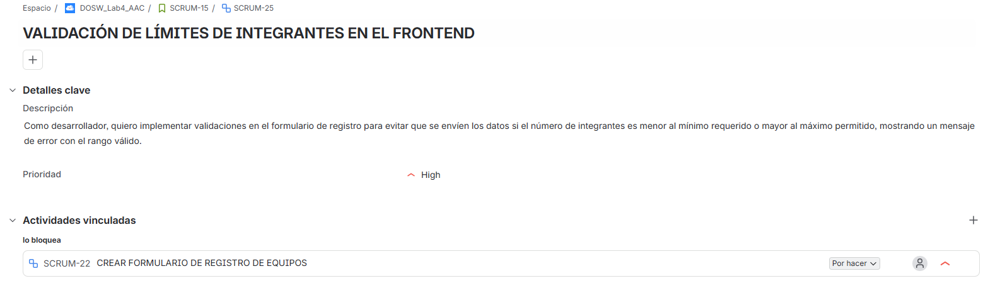
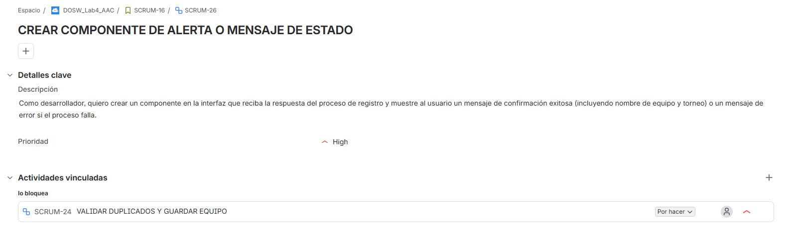
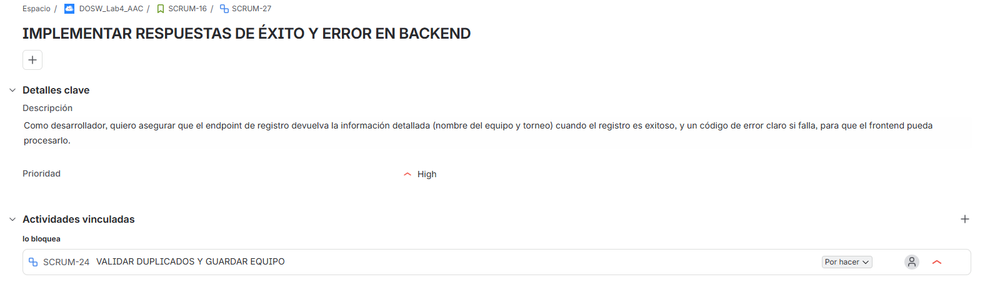
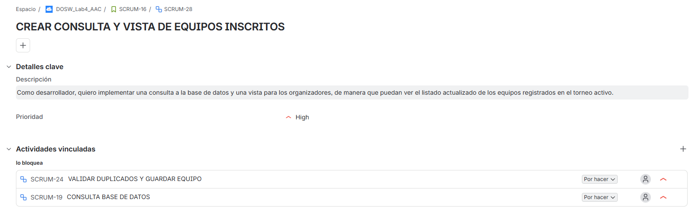

### 4. Cronograma:

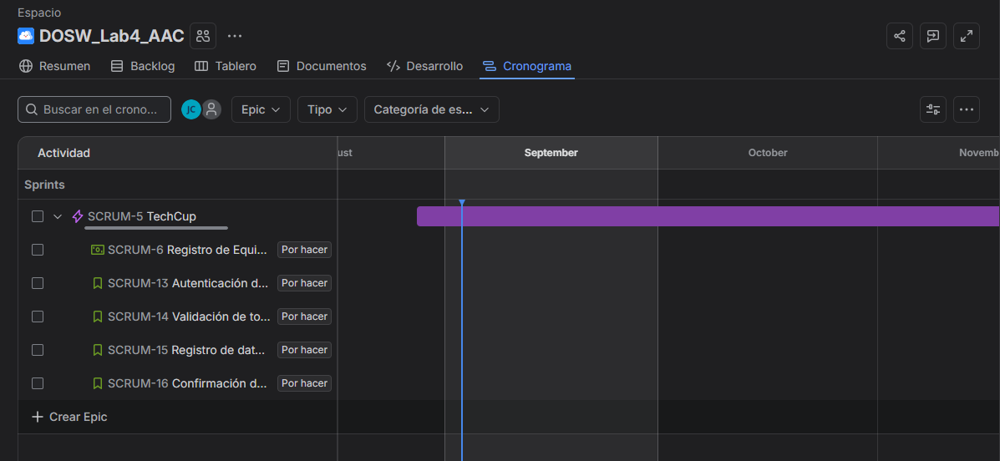

### 5. SPRINT 1:
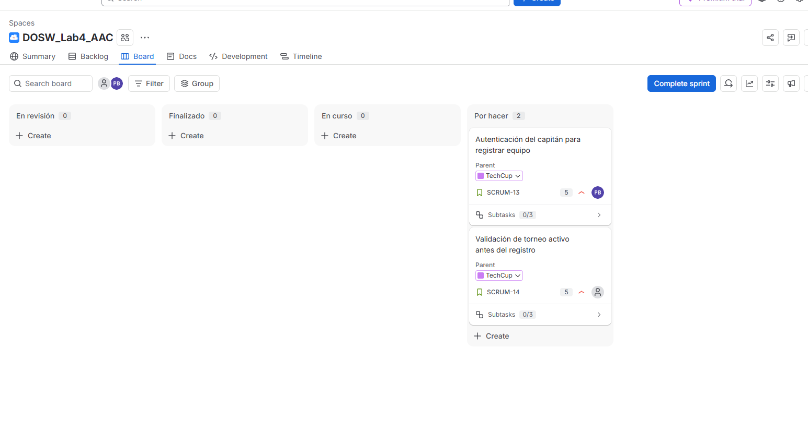

escogimos estas tareas para trabajar en este sprint ya que son las principales en nuestro pivote el scrum 13 y habiamos hablado que en puntos de historia no era tan grandes

### 6. video poker

el video no dejo subirlo aca por el tamaño del archivo esta ubicado en la images

